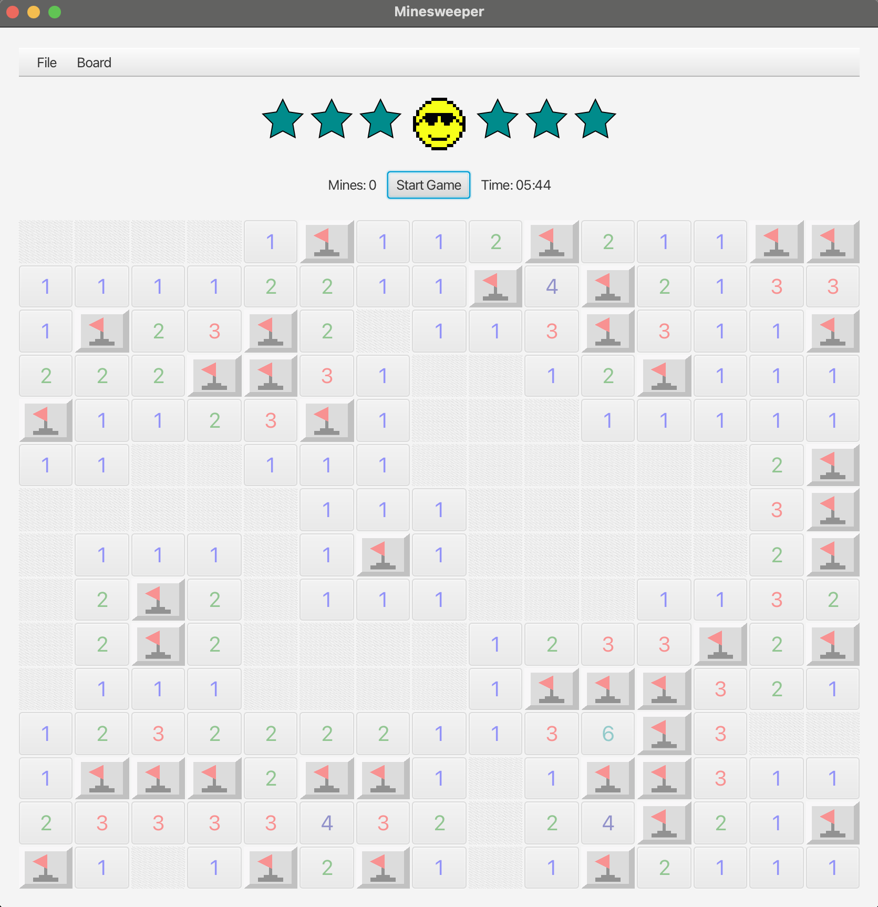
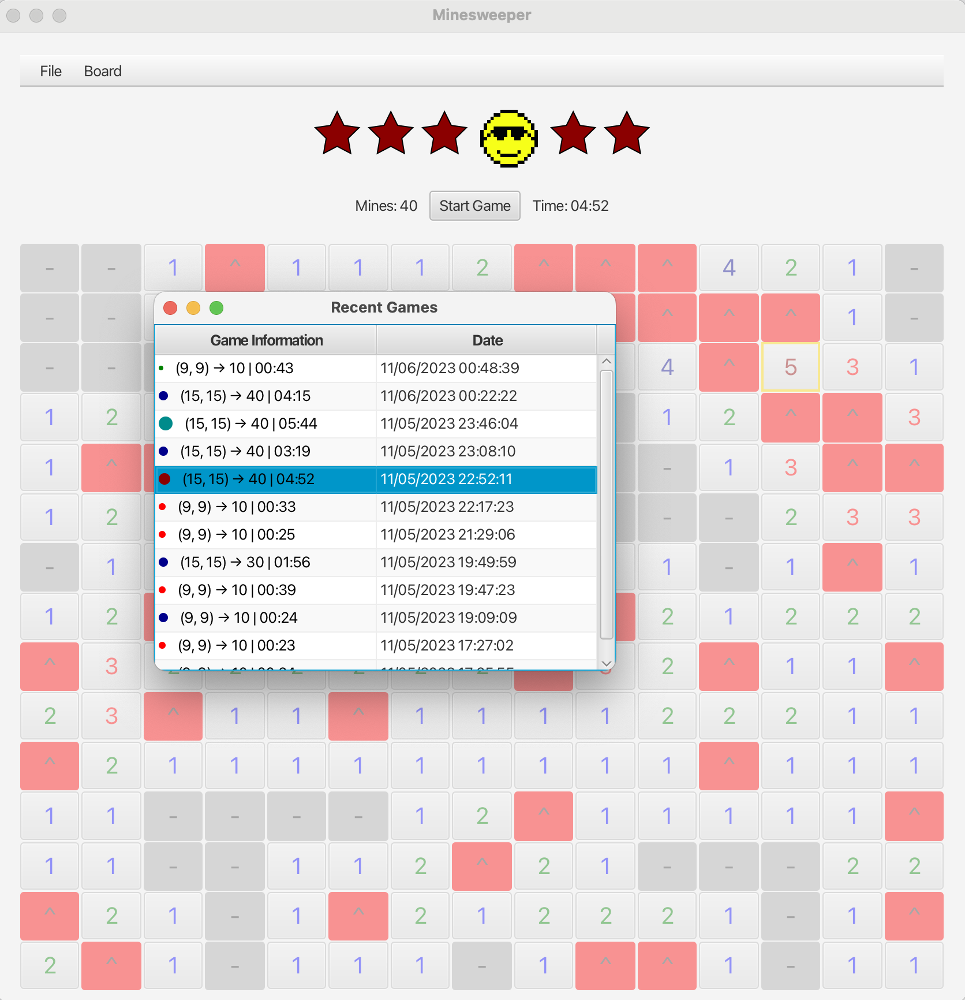

# Minesweeper
  

## A simple Minesweeper game written in Java using JavaFX and Maven
### Targeted for Java 21

## Features
* Left click to reveal a tile, right click to flag a tile.
* Press "Start Game" to start a new game.
* Use the dropdown menu (`Board`) to change the difficulty.
* Use "File -> Recent" to view previously completed games.

# Compile
* `mvn clean javafx:jlink`

## Coming features
* Save and load games
* High scores
